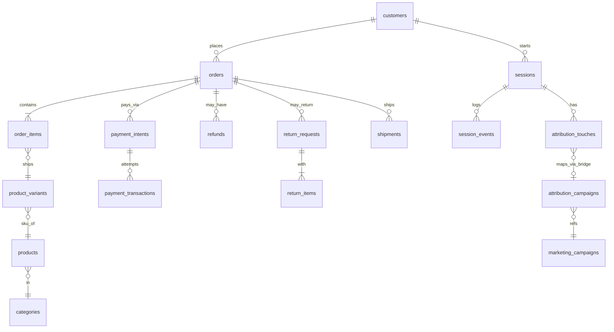

# ecom-analytics
[ecom_schema.md](https://github.com/dikshaadsul27-wq/ecom-analytics/blob/main/notes/ecom_schema.md)
# SQL Business Insights — Task 1 (ecom)

[Case study](CASE_STUDY.md) · [LinkedIn](https://www.linkedin.com/in/diksha-adsul-2607ba90/)

## Key Findings
- ...
- ...
- ...

## Schema (ER Diagram)

## Dashboard
Dashboard link : [Business Dashboard](https://metabase.topfolio.in/dashboard/42-task-1-sql-foundation)

The dashboard consists of below metrics
1. [Revenue by Order Date](screenshots/Revenue by Order Date)
2. Cohort by Month : 
3. Customer Retention by Month : 
4. Funnel Conversion by Acquisition Channel : 
5. Top Products by Net Revenue (After Refunds): 
6. Category by Revenue and Return Rate : 
7. Payment Failure Rate with Top Reasons : 
8. Delivery SLA Breach by Carrier × Shipping Method : 
9. Attribution Comparison: First-Touch vs Last-Touch Revenue by Channel : 

## What's in this repo
...

## How to run
...

## Reflection
