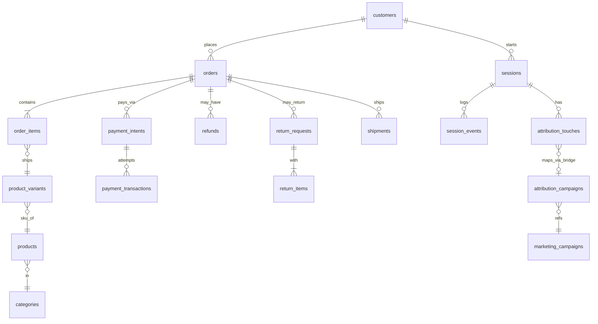

# ecom-analytics
[ecom_schema.md](https://github.com/dikshaadsul27-wq/ecom-analytics/blob/main/notes/ecom_schema.md)
# SQL Business Insights — Task 1 (ecom)

[Case study](CASE_STUDY.md) · [LinkedIn](https://www.linkedin.com/in/diksha-adsul-2607ba90/)

## Key Findings
- ...
- ...
- ...

## Schema (ER Diagram)

## Dashboard
Dashboard link : [Business Dashboard](https://metabase.topfolio.in/dashboard/42-task-1-sql-foundation)

The dashboard consists of below metrics
1. Revenue by Order Date : [screenshots/Revenue by Order Date.png](https://github.com/dikshaadsul27-wq/sql-business-insights/blob/c1db18714f003f7080d13df01abdb33657575437/screenshots/Revenue%20by%20Order%20Date.png)
2. Cohort by Month : [screenshots/Cohort by Month.png](https://github.com/dikshaadsul27-wq/sql-business-insights/blob/b5512d164bdbf59863d356a31a0f66f9740ff15e/screenshots/Cohort%20by%20Month.png)
3. [Customer Retention by Month] : [screenshots/Customer Retention by Month.png](https://github.com/dikshaadsul27-wq/sql-business-insights/blob/dab211e2a563c7bddadb371fdccdad9fca501fc4/screenshots/Customer%20Retention%20by%20Month.png)
4. [Funnel Conversion by Acquisition Channel] : [screenshots/Funnel Conversion by Acquisition Channel.png](https://github.com/dikshaadsul27-wq/sql-business-insights/blob/dab211e2a563c7bddadb371fdccdad9fca501fc4/screenshots/Funnel%20Conversion%20by%20Acquisition%20Channel.png)
5. [Top Products by Net Revenue (After Refunds)] : [screenshots/Top Products by Net Revenue (After Refunds).png](https://github.com/dikshaadsul27-wq/sql-business-insights/blob/dab211e2a563c7bddadb371fdccdad9fca501fc4/screenshots/Top%20Products%20by%20Net%20Revenue%20(After%20Refunds).png)
6. [Category by Revenue and Return Rate] : [screenshots/Category by Revenue and Return Rate.png](https://github.com/dikshaadsul27-wq/sql-business-insights/blob/dab211e2a563c7bddadb371fdccdad9fca501fc4/screenshots/Category%20by%20Revenue%20and%20Return%20Rate.png)
7. [Payment Failure Rate with Top Reasons] : [screenshots/Payment Failure Rate with Top Reasons.png](https://github.com/dikshaadsul27-wq/sql-business-insights/blob/dab211e2a563c7bddadb371fdccdad9fca501fc4/screenshots/Payment%20Failure%20Rate%20with%20Top%20Reasons.png)
8. [Delivery SLA Breach by Carrier × Shipping Method] : [screenshots/Delivery SLA Breach by Carrier × Shipping Method.png](https://github.com/dikshaadsul27-wq/sql-business-insights/blob/dab211e2a563c7bddadb371fdccdad9fca501fc4/screenshots/Delivery%20SLA%20Breach%20by%20Carrier%20%C3%97%20Shipping%20Method.png)
9. [Attribution Comparison: First-Touch vs Last-Touch Revenue by Channel] : [screenshots/Attribution Comparison: First-Touch vs Last-Touch Revenue by Channel.png](https://github.com/dikshaadsul27-wq/sql-business-insights/blob/dab211e2a563c7bddadb371fdccdad9fca501fc4/screenshots/Attribution%20Comparison-FirstTouch%20vs%20LastTouch%20Revenue%20by%20Channel.png)

## What's in this repo
...

## How to run
...

## Reflection
