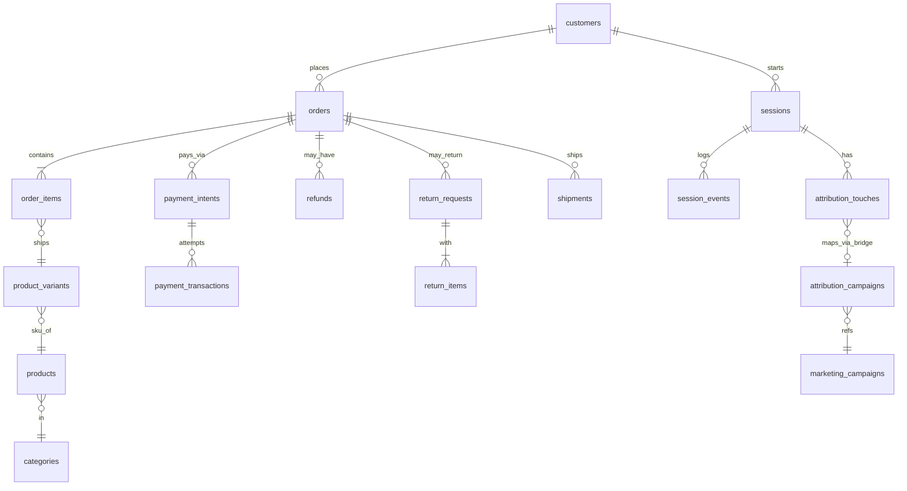

# ecom-analytics
[ecom_schema.md](https://github.com/dikshaadsul27-wq/ecom-analytics/blob/main/notes/ecom_schema.md)
# SQL Business Insights — Task 1 (ecom)

[Case study](CASE_STUDY.md) · [LinkedIn](...)

## Key Findings
- ...
- ...
- ...

## Schema (ER Diagram)

## Dashboard

## What's in this repo
...

## How to run
...

## Reflection
