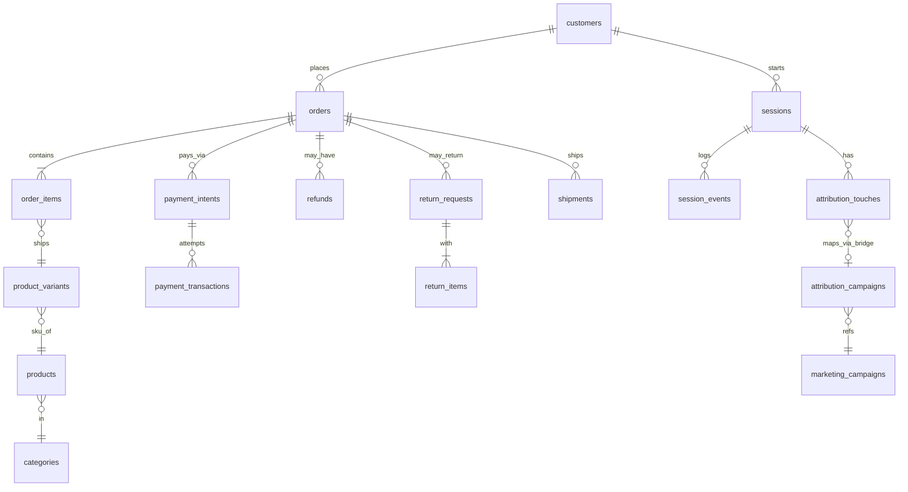

# SQL Business Insights — Task 1 (ecom)
[Case Study](https://github.com/dikshaadsul27-wq/sql-business-insights/blob/ece449fffa8136402828acd828a6edaab904b890/case_study.md) · [LinkedIn](https://www.linkedin.com/in/diksha-adsul-2607ba90/)

This repository is an e‑commerce analytics case study built with SQL queries, schema documentation, and business interpretations. It explores how raw transactional data can be transformed into actionable insights for leadership — covering daily KPIs, customer retention, funnel conversion, product profitability, category health, payment failures, delivery SLA breaches, customer lifetime value, repeat purchase intervals, and marketing attribution.

## Schema (ER Diagram)

[ecom_schema.md](https://github.com/dikshaadsul27-wq/ecom-analytics/blob/main/notes/ecom_schema.md)

## Dashboard
Dashboard link : [Business Dashboard](https://metabase.topfolio.in/dashboard/42-task-1-sql-foundation)

The dashboard consists of below metrics
1. Revenue by Order Date : [screenshots/Revenue by Order Date.png](https://github.com/dikshaadsul27-wq/sql-business-insights/blob/c1db18714f003f7080d13df01abdb33657575437/screenshots/Revenue%20by%20Order%20Date.png)
2. Cohort by Month : [screenshots/Cohort by Month.png](https://github.com/dikshaadsul27-wq/sql-business-insights/blob/b5512d164bdbf59863d356a31a0f66f9740ff15e/screenshots/Cohort%20by%20Month.png)
3. [Customer Retention by Month] : [screenshots/Customer Retention by Month.png](https://github.com/dikshaadsul27-wq/sql-business-insights/blob/dab211e2a563c7bddadb371fdccdad9fca501fc4/screenshots/Customer%20Retention%20by%20Month.png)
4. [Funnel Conversion by Acquisition Channel] : [screenshots/Funnel Conversion by Acquisition Channel.png](https://github.com/dikshaadsul27-wq/sql-business-insights/blob/dab211e2a563c7bddadb371fdccdad9fca501fc4/screenshots/Funnel%20Conversion%20by%20Acquisition%20Channel.png)
5. [Top Products by Net Revenue (After Refunds)] : [screenshots/Top Products by Net Revenue (After Refunds).png](https://github.com/dikshaadsul27-wq/sql-business-insights/blob/dab211e2a563c7bddadb371fdccdad9fca501fc4/screenshots/Top%20Products%20by%20Net%20Revenue%20(After%20Refunds).png)
6. [Category by Revenue and Return Rate] : [screenshots/Category by Revenue and Return Rate.png](https://github.com/dikshaadsul27-wq/sql-business-insights/blob/dab211e2a563c7bddadb371fdccdad9fca501fc4/screenshots/Category%20by%20Revenue%20and%20Return%20Rate.png)
7. [Payment Failure Rate with Top Reasons] : [screenshots/Payment Failure Rate with Top Reasons.png](https://github.com/dikshaadsul27-wq/sql-business-insights/blob/dab211e2a563c7bddadb371fdccdad9fca501fc4/screenshots/Payment%20Failure%20Rate%20with%20Top%20Reasons.png)
8. [Delivery SLA Breach by Carrier × Shipping Method] : [screenshots/Delivery SLA Breach by Carrier × Shipping Method.png](https://github.com/dikshaadsul27-wq/sql-business-insights/blob/dab211e2a563c7bddadb371fdccdad9fca501fc4/screenshots/Delivery%20SLA%20Breach%20by%20Carrier%20%C3%97%20Shipping%20Method.png)
9. [Attribution Comparison: First-Touch vs Last-Touch Revenue by Channel] : [screenshots/Attribution Comparison: First-Touch vs Last-Touch Revenue by Channel.png](https://github.com/dikshaadsul27-wq/sql-business-insights/blob/dab211e2a563c7bddadb371fdccdad9fca501fc4/screenshots/Attribution%20Comparison-FirstTouch%20vs%20LastTouch%20Revenue%20by%20Channel.png)

## What's in this repo
This repository documents an e‑commerce analytics case study with SQL queries, schema notes, interpretations, and visual outputs. It is organized as follows:

## notes/  
- Supporting documentation and schema exploration:
- Distinct Value Distribution.md — profiling distinct values across key fields.
- Inventory.md — product inventory notes.
- Row counts.md — dataset size checks.
- ecom_schema.md — schema reconnaissance and table relationships.

## queries/  
SQL scripts answering 10 core business questions:
- 01_daily_business_summary.sql — daily KPIs (revenue, orders).
- 02_monthly_cohort_retention.sql — retention by signup cohort.
- 03_funnel_conversion.sql — conversion rates by acquisition channel.
- 04_top_products_by_net_revenue.sql — product profitability after refunds.
- 05_category_health.sql — category‑level purchases vs. returns.
- 06_payment_failure_analysis.sql — payment failure reasons and rates.
- 07_delivery_sla_breach.sql — shipping delays by carrier/method.
- 08_customerltv_bucketshare_revenue.sql — revenue share by LTV buckets.
- 09_repeat_purchase_interval.sql — time between repeat purchases.
- 10_attribution_comparison.sql — first‑touch vs. last‑touch attribution.

## screenshots/  
Visual outputs of the SQL analyses:

Cohort retention charts, funnel conversion, attribution comparison, category health, SLA breach, payment failure reasons, and revenue trends.

## INTERPRETATIONS.md
Narrative business interpretations of query outputs.

## case_study.md
Consolidated case study write‑up.

## README.md
Repository documentation (this file).

## How to run

1. Clone the repository
git clone https://github.com/<dikshaadsul27-wq>/<sql-business-insights>.git
cd <sql-business-insights>

2. Set up a database connection
- Use any SQL client (e.g., PostgreSQL, MySQL, or your BI tool) connected to the ecom dataset.
- Ensure the schema matches the one documented in notes/ecom_schema.md.

3. Run queries
- Navigate to the queries/ folder.
- Each .sql file answers a specific business question (e.g., 04_top_products_by_net_revenue.sql).
- Execute the query in your SQL client to generate results.

4. View outputs
- Results can be validated against the sanity checks noted in each query.
- Visual outputs are available in the screenshots/ folder for quick reference.
- Business interpretations are documented in INTERPRETATIONS.md.

5. Case study narrative
- Read case_study.md for a consolidated walkthrough of the analysis and insights.

